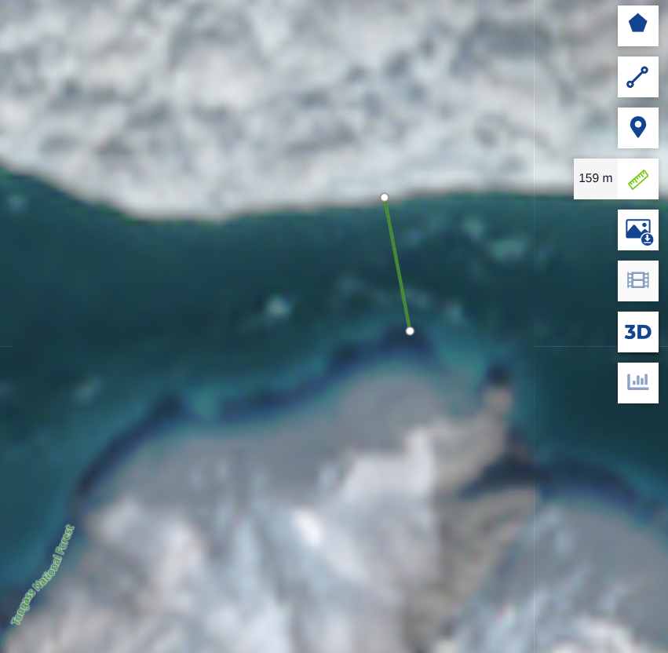

* Table of contents                               :toc_3:noexport:
- [[#introduction][Introduction]]

* Introduction

Sentinel provides 10 m resolution data

https://browser.dataspace.copernicus.eu/?zoom=14&lat=60&lng=-139.475

+ "Show latest date"
+ Select a color scheme:
  + Highlight Optimized True Color
  + SWIR
  + Scene classification map
+ On right, select tape measure and record distance between Gilbert Point and Hubbard Glacier.

